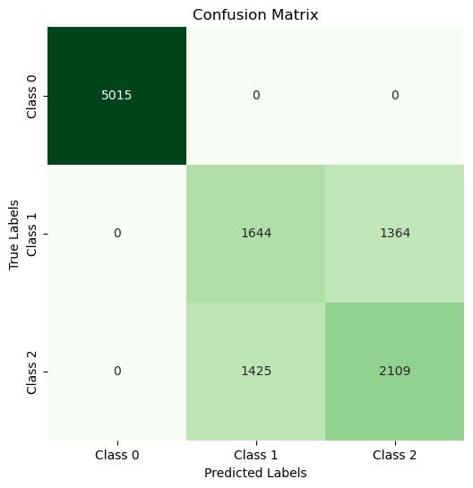
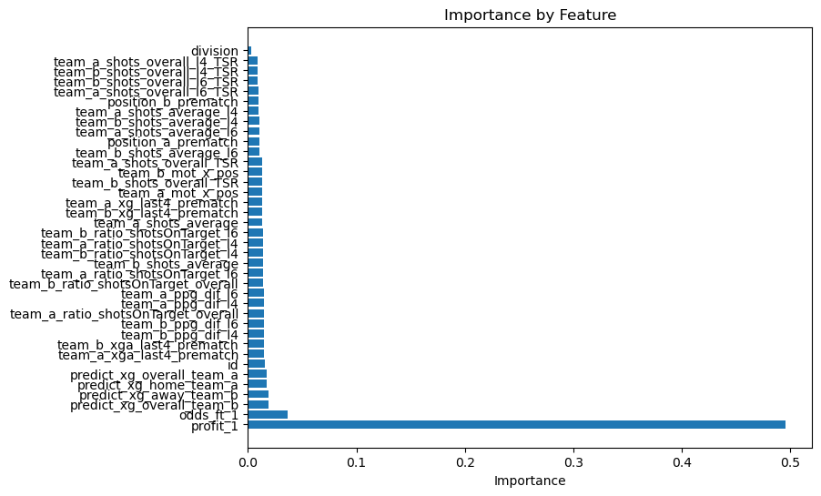
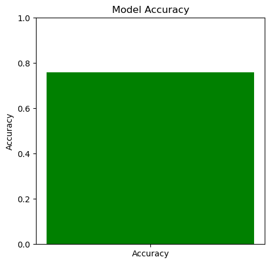
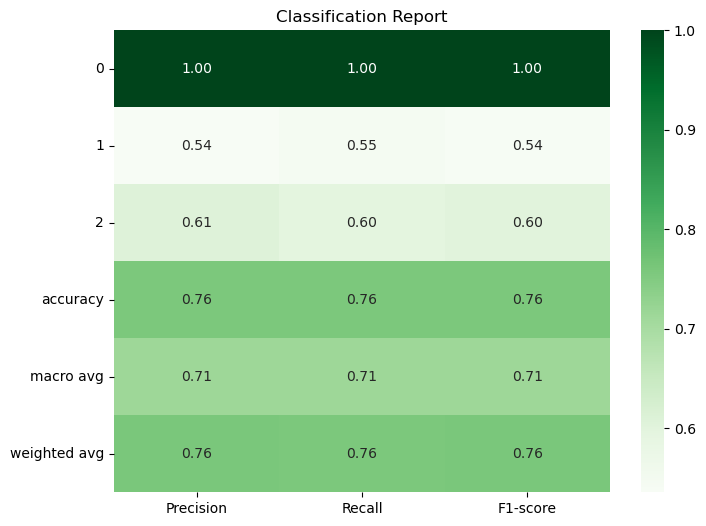
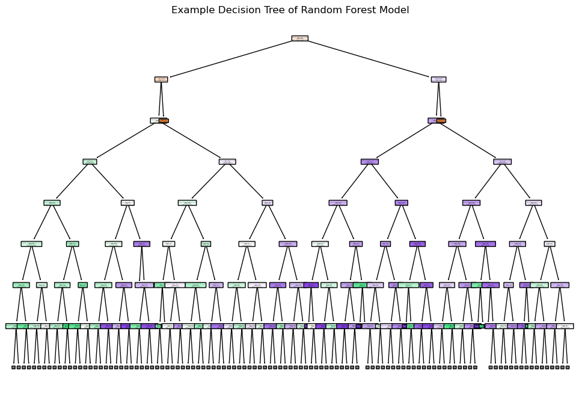

# Final Checkpoint

## GitHub Repository Layout Description

Descriptions for the key components of our repository:

**/Supervised/** - Folder for supervised model notebooks + visualizations

**/Supervised/random_forest.ipynb** - Random Forest Classifier notebook

**/Supervised/log_reg.ipynb** - Logistic Regression Classifier notebook

**/data_preprocessing.ipynb** - Data Preprocessing notebook

**/kmeans.ipynb** - K-Means Method notebook

**/train_dataset_preprocessed.csv** - training dataset, produced from data notebook

**/test_dataset_preprocessed.csv** - testing dataset, produced from data notebook 


## INTRODUCTION

The problem we are trying ot solve is the unpredictability of sports betting on soccer games. We aim to solve this problem by leveraging ML to create a model that predicts the outcome of soccer matches. Our ultimate goal is that this model will serve as a useful tool for sports betting on soccer.

### Literature Review
The application of machine learning (ML) in sports analytics, particularly in soccer, has garnered significant attention in recent years. Various studies have explored predictive modeling techniques to forecast match outcomes, leveraging historical data and advanced algorithms (Krutikov, Meltsov & Strabykin, 2022). One paper utilized logistic regression models to analyze team performance metrics, revealing that specific statistics, such as possession and shots on target, are strong predictors of match results. Another proposed a hybrid model combining ensemble learning and neural networks to improve the prediction of soccer match outcomes (Mun et al., 2023). Despite these advancements, many models still struggle with the inherent unpredictability of sports events, which can be influenced by unpredictable factors like referee decisions, player behavior, and real-time game dynamics (Letu 2022). 

### Dataset Description
This dataset contains historical data of soccer matches. Each row represents a unique match with various features describing the teams' performance prematch, betting odds, and more. Each row is also labeled as a HomeWin, Draw, or AwayWin.

### Dataset Link
https://www.kaggle.com/competitions/prediction-of-results-in-soccer-matches/data  


## PROBLEM DEFINITION

### Problem
The primary problem we are addressing is the unpredictability and uncertainty associated with sports betting on soccer matches. Traditional methods of predicting match outcomes often rely on simplistic heuristics or historical win-loss records, which fail to account for the complex and dynamic nature of soccer games. This unpredictability can lead to substantial financial losses for bettors and may discourage participation in sports betting. As a result, there is a pressing need for a more sophisticated and data-driven approach to accurately forecast match results.

### Motivation
The motivation for this project stems from the growing interest in sports analytics and the potential economic benefits it can bring to both bettors and sports organizations. With the increasing availability of detailed match data, betting odds, and player statistics, machine learning offers a promising avenue to enhance prediction accuracy. By developing a model that effectively analyzes historical soccer match data, we aim to provide a valuable tool for sports bettors, enabling them to make informed decisions based on data rather than intuition. 


## METHODS

### Data Preprocessing Methods Implemented

As we mentioned in our proposal, our data was well-formatted, but we further cleaned the dataset by removing null values. We also combined the 3 outcome columns (Home win, Away Win, and Draw) into a single outcome column that we could treat as out target value. Then we dropped the initial 3 columns, and used the 30 final columns as our dataset (with 29 features and 1 target). Another choice we made was to use the standard scaler on our feature columns, as most columns perform better with a standardized dataset. Other than the ID and Outcome columns, each column is normalized to a have a mean of 0 and variance of 1. We also experimented with PCA, which was after iterations of experimenting with models, but we decided to use all dimensions of our data rather than just a few principal components. Finally, we saved this dataset to a new csv.

### ML Algorithms/Models Implemented

For our 3 models, we implemented K-Means as our unsupervised learning method, and Random Forest and Logistic Regression for our supervised learning methods. Here is why we chose those models: 

1) We decided to work with Random Forest as it is a powerful multiclass classifier that works well with high dimensional data (compared to simpler classifier such as logistic regression). As it is an ensemble learning method, in that is leverages an ensemble of decision trees, it handled our 29 features well to predict the 1 target value of the outcome of the game. We also chose Random Forest due to the flexibility and customizability in its implementation with the libraries that we used, specifically in terms of hyperparameters that we could set. Specifically, we experimented with the max_depth of the trees and the number of decision trees that we were using. By setting these, we could directly control the extent to which the Random Forest classifier was fitting to our data, and viewing the visualizations while adjusting the levels of these hyperparameters helped us determine the best combination for our data (that mitigated both over and under fitting).
2) We also decided to use Logistic Regression as we were curious what a simpler classifier would do with our high dimensional data. We decided to use an L2 norm for our regularization (or penalty) function. Using ridge regression helped us make sure that coefficients never get set to 0, so that all features can contribute to the final prediction. If we used an L1 norm instead, the coefficients could be set to 0, which would mean that the final prediction would be based on a smaller number of features. The main benefit of using this Logistic Regression model is that we reduce overfitting when compared to Random Forest, as we have a simpler model and also an added benefit of regularization.
3) 

## RESULTS AND DISCUSSION

### Comparison 
First let's compare the supervised learning methods that we chose: Random Forest and Logistic Regression. Although we obtained similar accuracies on our dataset from both of these models, these models differ in their advantages and disadvantages. Firstly, Random Forest models are complicated and expensive, while Logistic Regression is simple. Related to this, Random Forest is also less interpretable, in that it is difficult to analyze how the features are contributing to the output. On the other hand, Logistic Regression has direct coefficients that explain the relationship between a feature and the target. Also, because Logistic Regression is simple, it is less prone to overfitting. Along with being simple, Logistic Regression combats overfitting with its L1/L2 regularization. Random Forest, especially with an inefficient set of hyperparameters, is prone to overfitting due to improper tuning of factors such as tree depth. 

Now let's compare these 2 supervised methods to the unsupervised method that we chose: K-Means. Firstly, these methods are similar in that they all categorize data into classes; they are all classification methods, even though K-Means utilizes clusters rather than classes. The main difference between these methods is that K-Means clusters without any target variable; it groups based on natural relationships between the features, rather than developing relationships to a target/label. This would mean that K-Means would be suitable in use cases where we have unlabeled data, and it is more appropriate for developing preliminary relationships, patterns, or trends in a dataset. Another difference between these methods is their capabilities of handling non-linear patterns in data. In this factor, K-Means is similar to Logistic Regression in that both of these methods struggle when the data has non-linear relationships. K-Means struggles as the distance formula is Euclidean distance (in 2D), and the clusters are also forced to be circular, while Logistic Regression struggles as the basic assumption is a linear relationship between the features and the log of the target. On the other hand, Random Forest handles non-linear relationships well as it can divide the feature space in many different ways due to how it branches based on features.

### Analysis:

### Random Forest/Logistic Regression Analysis:  

#### Preprocessing
1. **Standardization**: We standardized the features using `StandardScaler` to ensure that all features have a mean of 0 and a standard deviation of 1. This is crucial for models like SVM which are sensitive to the scale of input data.
   ```python
   from sklearn.preprocessing import StandardScaler
   features_to_scale = [col for col in data.columns if data[col].dtype in ['float64', 'int64'] and col not in ['id', 'Outcome']]
   scaler = StandardScaler()
   data[features_to_scale] = scaler.fit_transform(data[features_to_scale])

2. **Data Splitting**: We split the dataset into training and testing sets using `train_test_split` with a test size of 20% and a random state of 42 for reproducibility.
   ```python
   from sklearn.model_selection import train_test_split
   x_train, x_test, y_train, y_test = train_test_split(x, y, test_size=0.2, random_state=42)
   ```

#### Dropped Information
We dropped the following columns from the dataset:
- `Outcome`: This is the target variable we are trying to predict.
- `profit_2`, `profit_x`, `odds_ft_x`, `odds_ft_2`: These columns were not considered since they contribute too significantly to the model's predictive power and are not given when testing.
   ```python
   x = df.drop(['Outcome', 'profit_2', 'profit_x', 'odds_ft_x', 'odds_ft_2'], axis=1)
   y = df['Outcome']
   ```

**Random Forest Classifier**: An ensemble learning method that aggregates predictions from multiple decision trees to improve accuracy and reduce overfitting.
   ```python
   from sklearn.ensemble import RandomForestClassifier
   rf = RandomForestClassifier(n_estimators=200, random_state=42)
   rf.fit(x_train, y_train)
   preds = rf.predict(x_test)
   ```

**Logistic Regression Classifier**: A linear binary classification model that predicts the probability of a data point being in a class.
   ```python
   from sklearn.linear_model import LogisticRegression
   log_reg = LogisticRegression(penalty = 'l2', max_iter=1000, class_weight='balanced')
   log_reg.fit(x_train, y_train)
   preds = log_reg.predict(x_test)
   ```

#### Accuracy Check
We evaluated the models' performance using the following methods (the metrics are described within the methods):
1. **Accuracy**: The ratio of correctly predicted instances to the total instances.
   ```python
   from sklearn.metrics import accuracy_score
   acc = accuracy_score(y_test, preds)
   ```

2. **Confusion Matrix**: A table used to describe the performance of a classification model by comparing actual vs. predicted values.
   ```python
   from sklearn.metrics import confusion_matrix
   cm = confusion_matrix(y_test, preds)
   ```

3. **Classification Report**: Provides **precision**, **recall**, and **F1-score** for each class.
   ```python
   from sklearn.metrics import classification_report
   class_report = classification_report(y_test, preds)
   ```

   ```python
   import matplotlib.pyplot as plt
   import seaborn as sns

   # Feature Importance
   plt.figure(figsize=(8,6))
   plt.barh(range(len(features)), feature_importance[idxs], align='center')
   plt.yticks(range(len(features)), np.array(features)[idxs])
   plt.xlabel('Importance')
   plt.title('Importance by Feature')
   plt.show()

   # Model Accuracy
   plt.figure(figsize=(5, 5))
   plt.bar(['Accuracy'], [acc], color='Green')
   plt.ylim(0, 1)
   plt.title('Model Accuracy')
   plt.ylabel('Accuracy')
   plt.show()

   # Confusion Matrix
   plt.figure(figsize=(6, 6))
   sns.heatmap(cm, annot=True, fmt='d', cmap='Greens', cbar=False, xticklabels=['Class 0', 'Class 1', 'Class 2'], yticklabels=['Class 0', 'Class 1', 'Class 2'])
   plt.title('Confusion Matrix')
   plt.xlabel('Predicted Labels')
   plt.ylabel('True Labels')
   plt.show()
   ```

### K-Means Analysis: 

### Visualizations

**All charts are on the bottom**

### 1. Decision Tree Example (Random Forest only)
This visualization displays one of the 100 decision trees in our random forest model, an ensemble learning method based on tree structures. By visualizing a single tree, we gain insights into selecting an optimal `max_depth` for the entire forest. The example shown here is limited to a `max_depth` of 7 for readability, helping us observe how decisions are structured within each tree in the forest.

### 2. Feature Importance (Random Forest + Logistic Regression)
Feature importance helps us understand the contribution of each feature to the predictions. Scikit-learn’s random forest model inherently stores feature importance scores, as the method assigns weights to each feature based on its impact on decision-making. In our analysis, we identified that the top two features influencing the model were **profit through bets** and **odds to win**. This was intriguing as betting metrics appeared to have the most significant impact on the game’s outcome.

### 3. Model Accuracy Bar Graph (Random Forest only)
A bar graph displaying model accuracy serves as a straightforward visual of our accuracy metric, which is a single scalar value. This visualization is useful for comparing our model’s accuracy against other models when stacked, providing an intuitive look at overall model performance.

### 4. Confusion Matrix (Random Forest + Logistic Regression)
The confusion matrix visualizes hits and misses between classes, helping us understand areas where our model performs well and where it may fall short. From this matrix, we noticed that the model perfectly predicts **class 0** features, with no missed predictions—a sign of potential overfitting. Recognizing this pattern allows us to address overfitting in future model iterations.

### 5. Classification Report (Random Forest + Logistic Regression)
The classification report presents precision, recall, and F1-score metrics for each class as a heat map. This format allows us to compare key metrics across classes visually, making it easier to identify disparities in performance and areas that may need tuning.

### 6. ROC Curve (Logistic Regression only)
The ROC curve plots the tradeoff between the true positive and false positive rates for a classification model. The AUC metrics within an ROC curve (area under the curve) for each class helps us analyze the performance of the model at class level granularity. AUC values closer to 1 (perfect classification), such as our AUCs of 0.84 and 0.85, are better than an AUC value of 0.50, which represents random guessing.
### 7. Precision - Recall Curve (Logistic Regression only)
The Precision - Recall (or PR) curve plots the tradeoff between the precision and recall for a classification model. Precision is the metric related to minimizing false positives, while recall is related to predicting as many true positives as possible. This plot helps balance these 2 metrics for a holistically accurate model.

## Charts

### Random Forest:






### Logistic Regression:


Logistic Regression:


## Next Steps

Our next steps involve by tuning the hyperparameters for our models. We have a great baseline with both our unsupervised and supervised models, but we can further enhance these through strategies such as a grid search, which will allow us to find the best combination of hyperparameters for our models. We can also further experiment with more complex models, such as GB trees or SVM, which will be even more apt to working with higher dimensional data. 

## References

G. R. LeTu, "A Machine Learning Framework for Predicting Sports Results Based on Multi-Frame Mining," 2022 4th International Conference on Smart Systems and Inventive Technology (ICSSIT), Tirunelveli, India, 2022, pp. 810-813, doi: 10.1109/ICSSIT53264.2022.9716296. keywords: {Analytical models;Machine learning algorithms;Databases;Machine learning;Games;Predictive models;Prediction algorithms;Sports Outcome Forecast;Spark Machine Learning;Data Mining;Big Data},

K. Mun, B. Cha, J. Lee, J. Kim and H. Jo, "CompeteNet: Siamese Networks for Predicting Win-Loss Outcomes in Baseball Games," 2023 IEEE International Conference on Big Data and Smart Computing (BigComp), Jeju, Korea, Republic of, 2023, pp. 1-8, doi: 10.1109/BigComp57234.2023.00010. keywords: {Industries;Analytical models;Neural networks;Games;Machine learning;Organizations;Predictive models;Sports Prediction;Logistic Regression;Baseball Analysis;Sabermetrics;Siamese Network},

A. K. Krutikov, V. Y. Meltsov and D. A. Strabykin, "Evaluation the Efficienty of Forecasting Sports Events Using a Cascade of Artificial Neural Networks Based on FPGA," 2022 Conference of Russian Young Researchers in Electrical and Electronic Engineering (ElConRus), Saint Petersburg, Russian Federation, 2022, pp. 355-360, doi: 10.1109/ElConRus54750.2022.9755840. keywords: {Training;Solid modeling;Neurons;Artificial neural networks;Predictive models;Mathematical models;Forecasting;artificial intelligence;neural network;sports forecasting;training sampling;vector quantization;cascading;software system;FPGA},


## Gantt Chart

https://gtvault-my.sharepoint.com/:x:/g/personal/amistry31_gatech_edu/ERdTW3JDGQ9NibdAraEwbAIBa_T8pidvcs2EdB4nqX4twg?e=eV1qHs 


## Contribution Table

| Name     | Proposal Contributions    |
|----------|---------------------------|
| Ahaan    | Data Preprocessing + Github Page |
| Akshay   | Accuracy Metrics + Github Page       |
| Aryan    | Model Programming + Github Page                  |
| Pranav   | Model Analysis + Github Page |
| Veer     | Model Tuning + Github Page                      |
